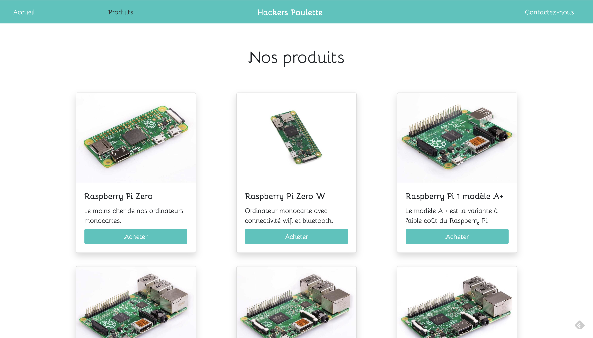
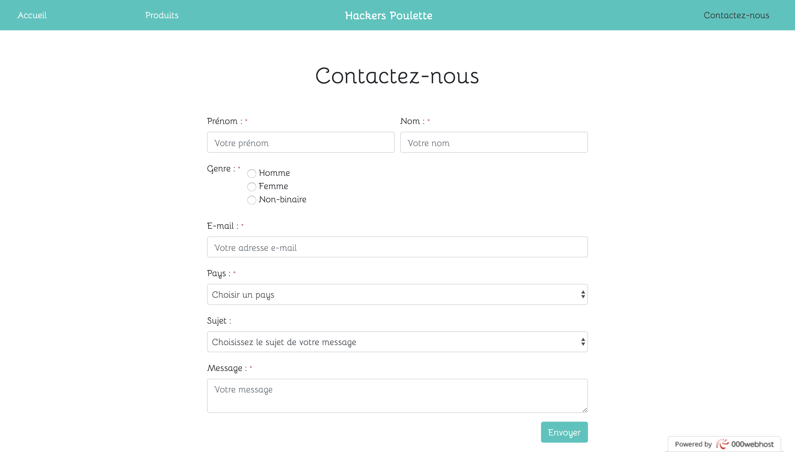

# projet-formulaire

[Hackers Poulette's website](https://rabbinical-definiti.000webhostapp.com/)

## Goal

The main goal of this project was to create a contact form with several requirements.

- Controlling the data client-side before sending it and server-side after it has been sent.
- Give a feedback to the user in case of wrong data entered, both in javascript and PHP.

## Technologies

- PHP
- Javascript
- Bootstrap V4
- SASS
- Git
- GitHub

## Preview 

## Dates

It has been done between Monday the 2nd of December and Friday the 6th of December.

## Team:

- [**Brice Bartoletti**](https://github.com/Levizar)
- [**Térence Hecq**](https://github.com/terencehecq)

Thanks to our [Woods team-mates](https://github.com/orgs/becodeorg/teams/crl-woods-2-15) from BeCode for helping.
